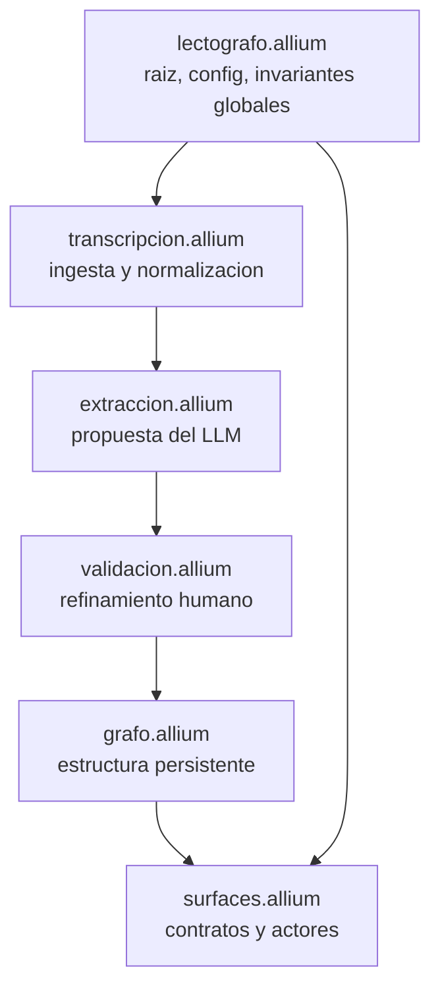
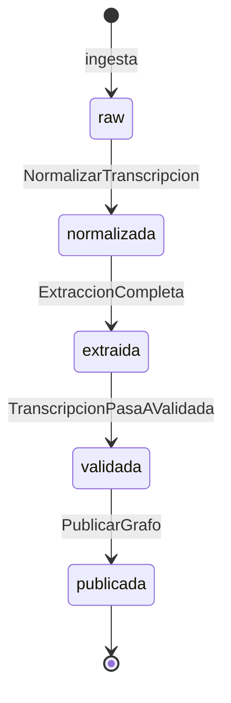

# Specs de Lectógrafo en Allium v3

Esta carpeta contiene la especificacion de comportamiento de Lectógrafo en lenguaje Allium. Allium describe que hace el sistema y bajo que condiciones, sin prescribir como esta implementado [^1].

## Orden de lectura

1. `lectografo.allium` para entender el alcance y la configuracion global.
2. `transcripcion.allium` para el ciclo de vida del texto.
3. `extraccion.allium` para la propuesta cruda del LLM.
4. `validacion.allium` para el flujo de decisiones del investigador.
5. `grafo.allium` para la estructura final persistente.
6. `surfaces.allium` para los contratos con los actores (investigador y LLM).

## Estados principales

## Como usar estos specs

Hablale al asistente (Claude Code u otro) en lenguaje natural sobre lo que quieres construir o cambiar; el asistente actualiza los `.allium` por ti. Para verificar la sintaxis instala el CLI de Allium [^2] y deja que valide automaticamente.

Las preguntas abiertas (`open question`) son decisiones explicitamente diferidas. No deben resolverse en codigo: hay que cerrarlas primero aqui.

## Notas al pie

[^1]: La referencia completa del lenguaje vive en `/Users/hspencer/Sites/allium/references/language-reference.md`. El skill principal en `/Users/hspencer/Sites/allium/SKILL.md`.

[^2]: `brew tap juxt/allium && brew install allium` o `cargo install allium-cli`.
